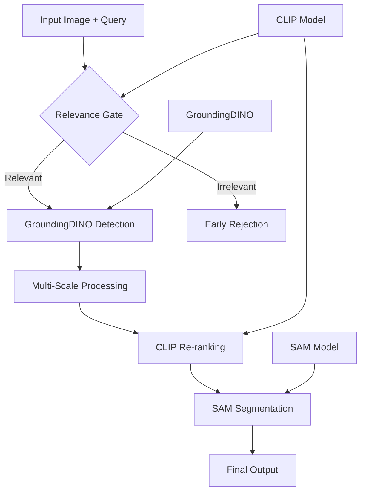

# System Architecture Documentation

## Overview

The Scene Localization system employs a multi-modal approach combining three state-of-the-art models to achieve accurate scene understanding and localization. The architecture is designed for robustness, efficiency, and scalability.

## Component Architecture



## Core Components

### 1. Relevance Gate (CLIP-based)

**Purpose**: Prevent processing of irrelevant queries to reduce false positives.

**Implementation**:
```python
class CLIPRerankerCPU:
    def full_image_similarity(self, image_bgr, query_text):
        # Encode full image and query
        # Return cosine similarity score
```

**Threshold**: 0.24 (empirically determined)
- Above threshold: Process with GroundingDINO
- Below threshold: Early rejection with explanation

### 2. GroundingDINO Detection Engine

**Model**: SwinT-OGC backbone
**Capabilities**:
- Open-vocabulary object detection
- Text-guided spatial grounding
- Multi-scale feature extraction

**Configuration**:
- Box threshold: 0.25 (balanced precision/recall)
- Text threshold: 0.2 (language understanding sensitivity)
- NMS threshold: 0.6 (overlap handling)

**Tiling Strategy**:
```python
def sliding_window_tiles(image, tile_size=1000, overlap=0.25):
    # Process large images in overlapping tiles
    # Reconstruct global coordinates
```

### 3. CLIP Re-ranking Module

**Purpose**: Refine detections using visual-textual similarity.

**Process**:
1. Crop detected regions
2. Encode visual features
3. Compare with text query embedding
4. Combine with detection confidence: `0.6 * detection_score + 0.4 * clip_similarity`

### 4. SAM Segmentation

**Model**: ViT-H (Huge) variant for maximum precision
**Input**: Bounding box from refined detection
**Output**: Pixel-perfect segmentation mask

**Integration**:
```python
sam_predictor.set_image(rgb_image)
masks, _, _ = sam_predictor.predict(box=bounding_box)
```

## Processing Pipeline

### Stage 1: Input Validation and Preprocessing
- Image format validation
- Query text preprocessing
- Relevance assessment via CLIP

### Stage 2: Detection Phase
- GroundingDINO inference
- Optional tiling for large images
- Initial bounding box generation

### Stage 3: Refinement Phase
- CLIP-based re-ranking
- Soft-NMS for overlap resolution
- Confidence score fusion

### Stage 4: Segmentation Phase
- SAM mask generation
- Mask refinement and validation
- Output preparation

## Advanced Features

### Soft Non-Maximum Suppression
Implements linear decay instead of hard suppression:
```python
if iou > 0.3:
    scores[idx] = scores[idx] * (1 - iou)
```

### Weighted Box Fusion
Combines overlapping detections from multiple scales:
```python
fused_box = (cluster_boxes * weights[:, None]).sum(axis=0)
```

### Multi-Scale Processing
- Tile size: 1000×1000 pixels
- Overlap: 25% for boundary object handling
- Global coordinate reconstruction

## Performance Optimizations

### CPU-First Design
- All models run efficiently on CPU
- Memory-optimized inference
- Minimal GPU dependencies

### Memory Management
- Lazy model loading
- Batch processing for multiple crops
- Efficient tensor operations

### Caching Strategy
- Model weights cached locally
- Preprocessing pipelines reused
- Configuration-based parameter tuning

## Quality Assurance

### Confidence Thresholding
- Multi-level thresholds for different components
- Adaptive thresholding based on image complexity
- Confidence fusion across modalities

### Error Handling
- Graceful degradation on component failure
- Comprehensive logging and debugging
- User-friendly error messages

### Validation Pipeline
- Bounding box area validation
- Aspect ratio constraints
- Semantic consistency checks

## Configuration Management

### Model Parameters
```yaml
detection:
  base_confidence: 0.25
  nms_threshold: 0.6
  clip_threshold: 0.24
  min_box_area: 64
  max_box_area_ratio: 0.95

processing:
  tile_size: 1000
  overlap_ratio: 0.25
  enable_soft_nms: true
```

### Runtime Settings
- Device selection (CPU/GPU)
- Memory allocation limits
- Parallel processing options

## Extensibility

The architecture supports easy extension:
- **New Detection Models**: Replace GroundingDINO interface
- **Alternative Segmentation**: Swap SAM with other segmentation models
- **Custom Post-processing**: Add new refinement stages
- **Performance Monitoring**: Integrate timing and accuracy metrics

## Future Enhancements

1. **Multi-Query Processing**: Handle multiple queries simultaneously
2. **Temporal Consistency**: Video sequence processing
3. **Active Learning**: Incorporate user feedback
4. **Model Ensemble**: Combine multiple detection models
5. **Edge Optimization**: Mobile deployment optimizations